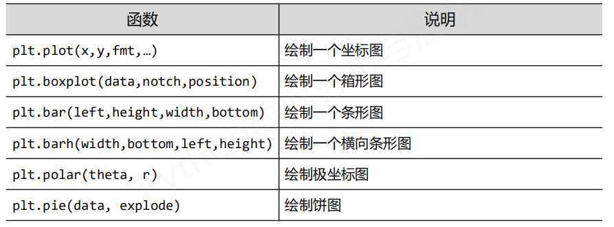
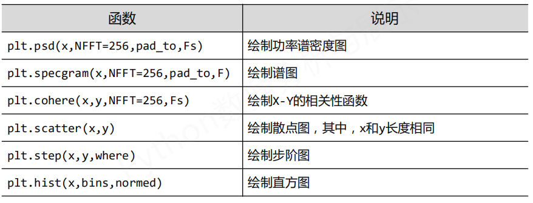
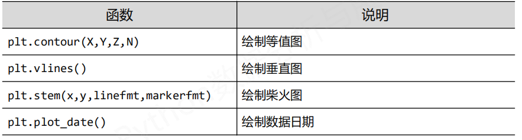
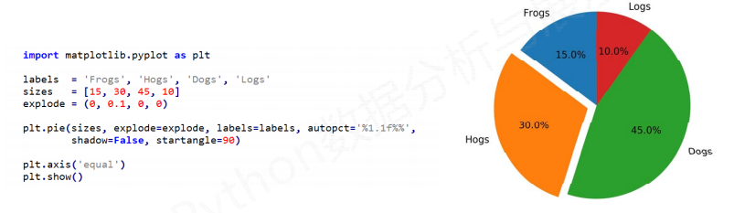
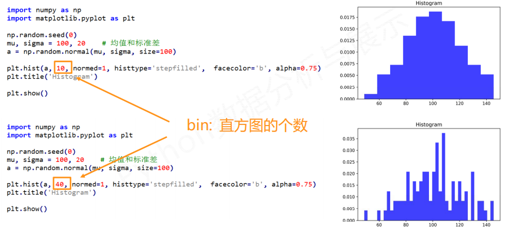
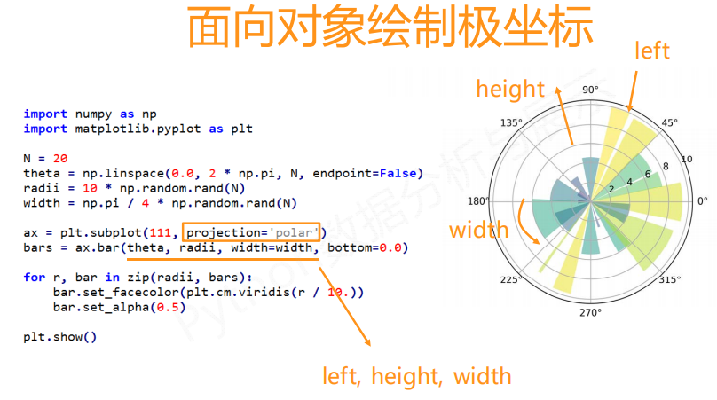
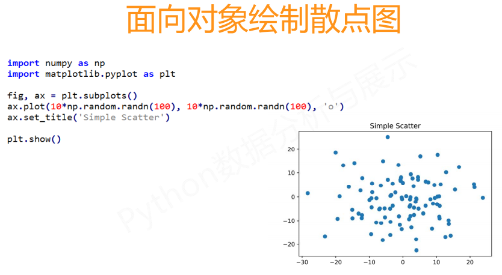

# 基本绘图函数

### 16种基本绘图函数

### 绘制饼图

`plt.pie()`

> plt.axis('equal')  设置成平面图

### 绘制直方图

`plt.hist()`

直方图的高度，说明在某个区域的个数多少

normed = 1 的时候，直方图中出现的个数归一化成 比例或概率

直方图的类型，直方图的颜色，直方图的绘制比例

### 绘制极坐标图

等分成20个角度

先 生成了各个数组

theta是从何处开始的  raddi是高度  width 是区域的面积

### 绘制散点图

### 哪些数据适合用哪些数据图来绘制

折线图适合用于趋势分析；

柱状图适合用于数值对比；

饼状图适合用于比例对比

散点图适合用于统计分析，研究变量之间的相关性；

雷达图适合用于分析多个维度的强弱等等

股市的数据适合用箱线图

市场占有率适合饼图

销售额可以用直方图、折线图

日程表可以用甘特图

- 展示阶段时间的变化可以用坐标图，比如房价走势图，股价金价走势图；
- 展示占比分布可以用饼图，比如世界石油出口各国占比份额，中国各手机品牌市场份额；
- 展示地区分布可以用散点图，比如中国铁矿分布图，天津加油站分布图；
- 展示样品数据和比较可以用横向条形图，比如十种当下流行英特尔各型号处理器性能对比图，百度前十关键词搜索量次对比图。
- 展示频谱数据可以用谱图，比如光谱图，信号处理和音频处理图。
- 展示某定点周围某元素分布可以用极坐标图，比如雷达图，冒险类游戏展示周围敌人分布的小地图。

1.柱状图

适用场景：适用场合是二维数据集（每个数据点包括两个值x和y），但只有一个维度需要比较，用于显示一段时间内的数据变化或显示各项之间的比较情况。

优势：柱状图利用柱子的高度，反映数据的差异，肉眼对高度差异很敏感。

劣势：柱状图的局限在于只适用中小规模的数据集。

延伸图表：堆积柱状图、百分比堆积柱状图，堆积图不仅可以直观的看出每个系列的值，还能够反映出系列的总和，尤其是当需要看某一单位的综合以及各系列值的比重时，最适合。

2.条形图

适用场景：显示各个项目之间的比较情况，和柱状图类似的作用；

优势：每个条都清晰表示数据，直观；

延伸图表：堆积条形图、百分比堆积条形图

3.折线图

适用场景: 折线图适合二维的大数据集，还适合多个二维数据集的比较。

优势：容易反应出数据变化的趋势。

4.各种数据地图（一共有7种类型）

适用场景：适用于有空间位置的数据集；

优劣势：特殊状况下使用，涉及行政区域；

（1）行政地图（面积图）

（2）行政地图（气泡图）

（3）地图图表：气泡图

（4）地图图表：热力图

（5）地图图表：海量点

（6）地图图表：地图+柱状/饼图/条形

（7）地图图表：动态轨迹图

5.饼图（环图）

适用场景：显示各项的大小与各项总和的比例。适用简单的占比比例图，在不要求数据精细的情况适用。

优势：明确显示数据的比例情况，尤其合适渠道来源分析等场景。

劣势：肉眼对面积大小不敏感。

6.雷达图

适用场景：雷达图适用于多维数据（四维以上），且每个维度必须可以排序，数据点一般6个左右，太多的话辨别起来有困难。

优势：主要用来了解公司各项数据指标的变动情形及其好坏趋向。

劣势：理解成本较高。

7.漏斗图

适用场景：漏斗图适用于业务流程多的流程分析，显示各流程的转化率。

优势:在网站分析中，通常用于转化率比较，它不仅能展示用户从进入网站到实现购买的最终转化率，还可以展示每个步骤的转化率，能够直观地发现和说明问题所在。

劣势:单一漏斗图无法评价网站某个关键流程中各步骤转化率的好坏。

8.词云

适用场景： 显示词频，可以用来做一些用户画像、用户标签的工作。

优势：很酷炫、很直观的图表。劣势：使用场景单一，一般用来做词频。

9.散点图

适用场景：显示若干数据系列中各数值之间的关系，类似XY轴，判断两变量之间是否存在某种关联。散点图适用于三维数据集，但其中只有两维需要比较。

优势：对于处理值的分布和数据点的分簇，散点图都很理想。如果数据集中包含非常多的点，那么散点图便是最佳图表类型。

劣势：在点状图中显示多个序列看上去非常混乱。

延伸图表：气泡图（调整尺寸大小就成气泡图了）

10.面积图

适用场景：强调数量随时间而变化的程度，也可用于引起人们对总值趋势的注意。

延伸图表：堆积面积图、百分比堆积面积图还可以显示部分与整体之间（或者几个数据变量之间）的关系。

11.指标卡

适用场景：显示某个数据结果&同环比数据。

优势：适用场景很多，很直观告诉看图者数据的最终结果，一般是昨天、上周等，还可以看不同时间维度的同环比情况。

劣势：只是单一的数据展示，最多有同环比，但是不能对比其他数据。

12.计量图

适用场景：一般用来显示项目的完成进度。

优势：很直观展示项目的进度情况，类似于进度条。

劣势：表达效果很明确，数据场景比较单一。

13.瀑布图

适用场景：采用绝对值与相对值结合的方式，适用于表达数个特定数值之间的数量变化关系，最终展示一个累计值。

优势：展示两个数据点之间的演变过程，还可以展示数据是如何累计的。

劣势：没有柱状图、条形图的使用场景多。

14.桑基图

适用场景：一种特定类型的流程图，始末端的分支宽度总各相等，一个数据从始至终的流程很清晰，图中延伸的分支的宽度对应数据流量的大小，通常应用于能源、材料成分、金融等数据的可视化分析。

15.旭日图

适用场景：旭日图可以表达清晰的层级和归属关系，以父子层次结构来显示数据构成情况，旭日图能便于细分溯源分析数据，真正了解数据的具体构成。

优势：分层看数据很直观，逐层下钻看数据。

16.矩形树图

适用场景：和旭日图类似。

17.对比条形图

适用场景：对比2个数值的关系；

18.双轴图

适用场景：柱状图+折线图的结合，适用情况很多，数据走势、数据同环比对比等情况都能适用。

优势：特别通用，是柱状图+折线图的结合，图表很直观。

劣势：这个好像没什么劣势，个人感觉。

### 引力波绘制

