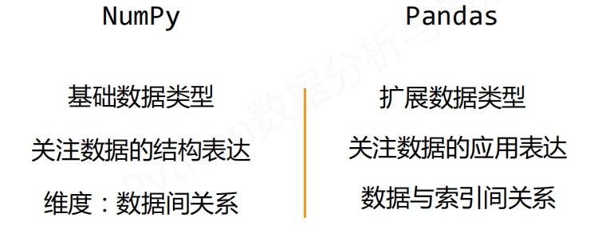
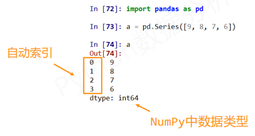
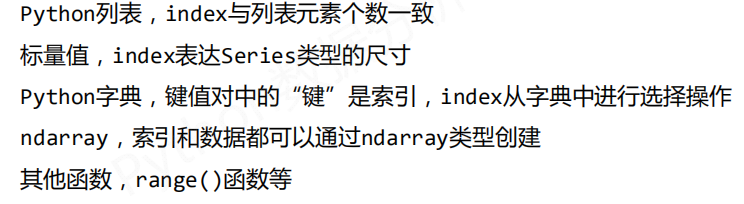
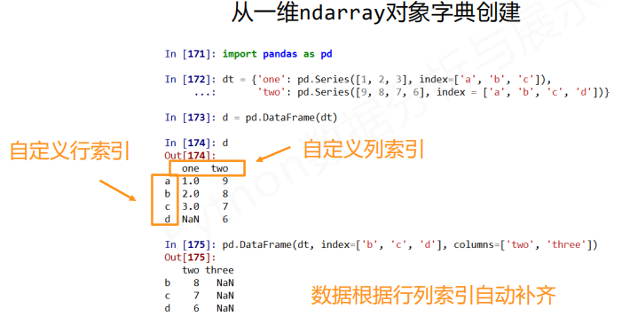
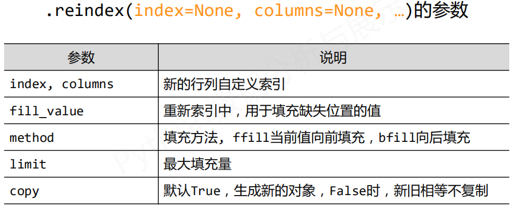
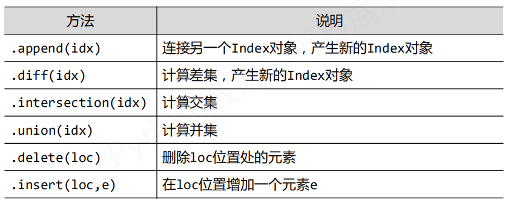
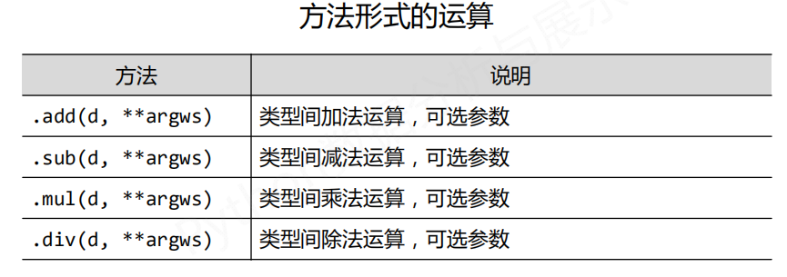

# pandas库介绍

处理数据和分析数据最好的第三方库

pandas 提供高性能易用数据类型和分析工具，基于numpy


### pandas库的理解

两个数据类型： Series（相当一个一维数据类型）, DataFrame（二维到多维）

基于上述数据类型的各类操作（数据分析和数据操作）

- 基本操作
- 运算操作
- 提取特征操作
- 查找关联性操作


### 对比numpy与pandas



数据与索引形成关系


### series数据类型

series 是一维带"标签"数组

由一组数据及与之相关的数据索引组成



> 自定义索引，作为第二个参数，可以省略index= ['a','b','c','d']

#### series 创建

series可由如下类型创建：

- python列表
- 标量值   `s=pd.Series(25,index=['a', 'b', 'c'])`
- python字典
- ndarray  `index=np.arrange(9, 4, -1)  生成9 8 7 6 5`
- 其他函数




#### series基本操作

series类型包括index和values两个部分

对于series操作类似ndarray类型和python的字典类型

- `.index` 获取索引
- `.values` 获取数据

> series 索引
>
> 自动索引和自定义索引是并存的，但是两套索引并存，却不能同时混用


numpy中运算和操纵可用于series类型

- 可以通过自定义索引的列表进行切片
- 可以通过自动索引进行切皮，如果存在自定义索引，则一同被切片

`b[b > b.median()]` 这也是一种切片操作

python字典操作也使用

- 通过自定义索引访问
- 保留字 in 操作  （是否在用户自定义索引中，不会判断自动索引）
- 使用 `.get()` 方法， .get("f", 100)  （如果存在“f"标签的value则返回，负责返回100）

#### series 对齐操作

series类型在运算中会自动对齐不同索引的数据

#### series name属性

series对象和索引都可以有个名字，存储在属性`.name`中

```python
b.name = 'Series对象'
b.index.name = '索引列'
```


series 对象可以随时修改并即刻生效


### DataFrame 数据类型

DataFrame 是二维带”标签“数组

DataFrame 共用相同索引的数据类型

由索引和多列数据组成

index    axis = 0 (轴) 跨行操作

column  axis = 1 (轴) 跨列操作  表头

- DataFrame 是一个表格型的数据类型，每列值类型可以不同
- DataFrame 既有行索引、也有列索引
- DataFrame 常用于表达二维数据，但可以表达多维数据


 #### DataFrame 创建

- 二维ndarray对象
- 由一维ndarray、列表、字典、元组或series构成的字典
- series类型
- 其他的DataFrame类型


从字典中创建




#### DataFrame 基本操作

DataFrame 基本操作类似series,依据行列索引

`.loc for label based indexing or`

`.iloc for positional indexing`


`c.index`  

`c.columes`  (表头了)

`c.value`


```python
print(c['同比'])  # 可以获取其中的一列，每一列元素是一个Series对象
print(c.loc['c1'])  # 获取其中一行，一行的元素就是一个Series对象
print(c['同比']['c2'])  # 顺序不能颠倒
```


### 数据类型操作

改变Serieshe DataFrame对象的结构

增加或重排：重新索引  `.reindex()`

删除：drop

#### 重新索引`.reindex()`



`d.columns.insert(4,'新增')` 新增表头了


#### 索引类型的常用方法

 索引类型是 Index

Series和DataFrame的索引是Index类型

```python
# 这些都是对索引操作
# 但是删除和插入索引，都会直接地影响到一整行和一整列地值
nc = d.columns.delete(2)
ni = d.index.insert(5,'c0')
```


Index 对象是不可修改的类型



删除指定索引对象

`.drop()`能够删除Series和DataFrame指定行或列索引。删除行或列

删除列 `d.drop('同比'，axis=1)`  修改axis参数


### 数据类型运算

#### 算术运算法则

- 算术运算根据行列索引，补齐后运算，运算默认产生浮点数
- 补齐时缺项，填充NaN(空值)
- 维度不同时 （二维和一维、一维和零维）为广播运算
- 采用+ - * / 符号进行的二元运算，产生新的对象

可以用方法运算，可以添加参数



> fill_value参数替代NaN，替代后参与运算

广播运算

低维的数据，作用到高维的每一行中。

一维Series默认和高维的轴1 参与运算

> 运算方法：axis = 0,可以令一维Series参与轴0运算


#### 比较运算法则

- 比较运算智能比较相同索引的元素，不进行补齐
- 二维和一维、一维和零维间为广播运算
- 采用`>  <  >=  <=  ==  !=`等符号进行的二元运算产生布尔对象  （dtype: bool）


### 重点

操作索引即操作数据

不需要太注重 数据的维度和结构

注意：元素的对齐和填充 

像对待单一数据一样对待Series和DataFrame对象