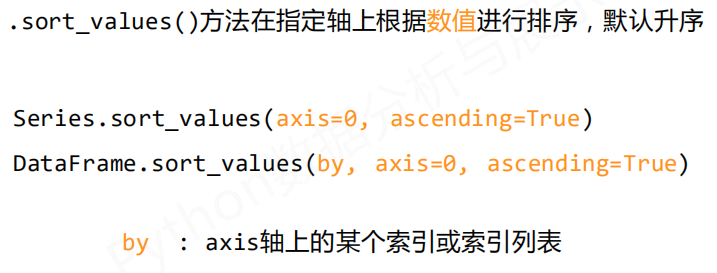
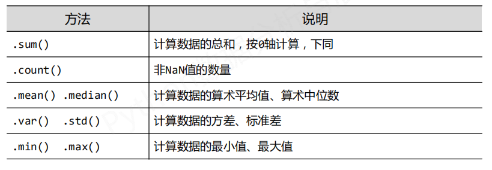
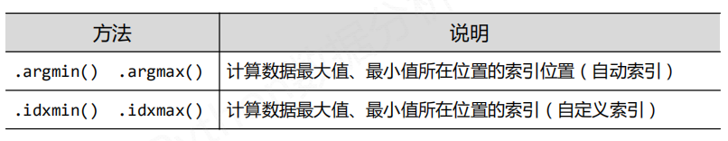
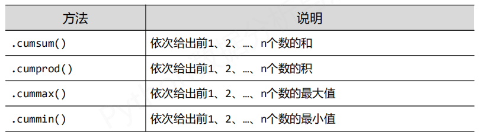
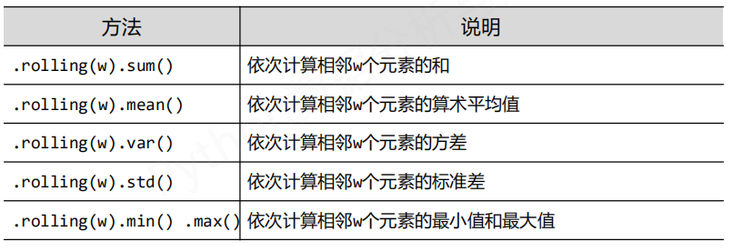
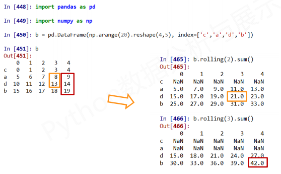
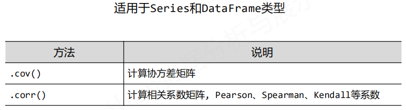

# 数据特征分析

数据形成过程中

### **摘要**：有损地提取数据特征的过程

一组数据进行摘要之后，可以用于：

- 基本统计（排序）
- 分布/累计统计
- 数据特征（相关性、周期性等）
- 数据挖掘（形成知识）

### 第一步，排序

pandas库既可以操作数据，也可以操作索引。

#### 对索引排序

#### 对数据排序

有`by`参数，就只对单一行或列操作。

> NaN 统一放在排序末尾

### 统计分析

适用于Series和DataFrame类型

> `.describe()` 针对0轴（各列）的统计汇总
>
> 统计分析的所有值
>
> type(a.describe())  
>
> series.Series 或者 frame.DataFrame

适用于Series类型

### 累计统计分析函数

适用于Series和DataFrame类型，

减少for循环的使用，计算更加简洁

> 按照列方向

滚动计算函数,相邻值

计算结果 默认为浮点数

### 数据的相关分析

两个事物，表示为X和Y,如何判断它们之间的存在相关性

- 正相关
- 负相关
- 不相关

常见的函数

#### 协方差

- 协方差>0，X和Y正相关
- 协方差<0，X和Y负相关
- 协方差=0，X和Y独立无关

#### Pearson相关系数

r取值范围[-1,1]

- 0.8-1.0  极强相关
- 0.6-0.8  强相关
- 0.4-0.6  中等程度相关
- 0.2-0.4  弱相关
- 0.0-0.2  极弱相关或无相关

